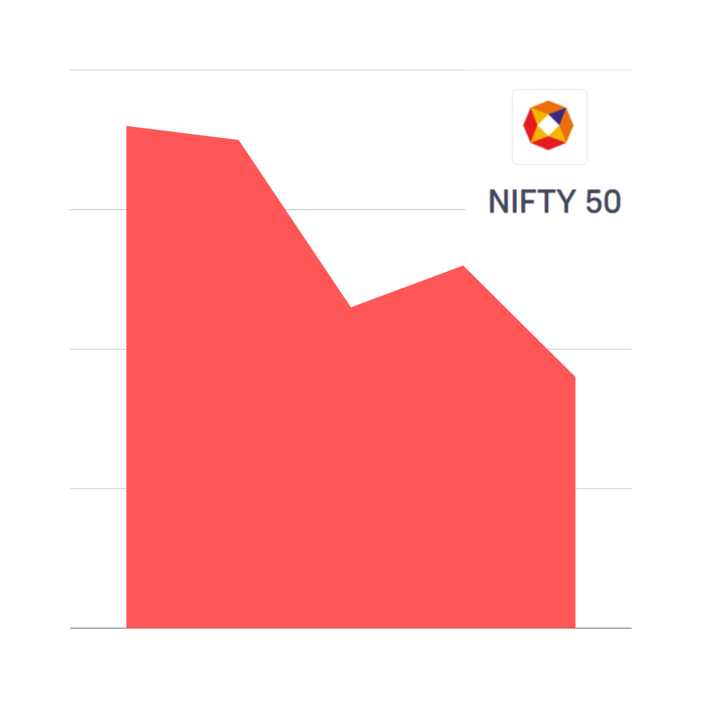

# Nifty Index Alert System

## Overview
This project consists of two Python scripts that work together to provide a Nifty Index alert system. The system monitors the Nifty Index and sends alerts via a Telegram bot to a dedicated group when specific conditions are met.

### Main Script (nifty_alert.py)
The `nifty_alert.py` script is responsible for the Nifty Index monitoring and alert logic. It runs every weekday and checks the following conditions:
- Crosses the 50-day Moving Average (DMA) from below or above.
- Crosses the 100-day DMA from below or above.
- Crosses the 200-day DMA from below or above.
- Is within 10% of the 52-week high or 52-week low.

The script uses the Yahoo Finance API to fetch Nifty Index data and calculates various metrics like moving averages and 52-week high/low. If any of the conditions are met, it triggers an alert using the `nifty_alert` function defined in the `Telebot` script.

### Telebot Script (telegram_bot.py)
The `telegram_bot.py` script handles the communication part by sending alerts to a Telegram group. It uses the Telebot library and reads the Telegram bot token and group chat ID from environment variables. The `nifty_alert` function in this script sends messages with relevant information and links to trading platforms.

## Prerequisites
Before running these scripts, ensure you have the following prerequisites:
- Python installed on your system (Python 3.x recommended).
- Required Python packages - yfinance and telebot.
- A Telegram bot token, which can be obtained by creating a bot on Telegram using BotFather.

## Setup
1. Clone this repository to your local machine using `git clone`.
2. Create a `.env` file in the project directory with the following content:

API_KEY=YOUR_TELEGRAM_BOT_TOKEN
GROUP_ID=YOUR_CHAT_ID

Replace `YOUR_TELEGRAM_BOT_TOKEN` with your Telegram bot token and `YOUR_CHAT_ID` with the chat ID of the group where you want to send alerts.

### Image Alerts
The Nifty Index Alert System also includes visual cues to indicate market conditions. When sending alerts, the script attaches images to provide a quick visual reference. The following images are used:

- **Rise Image**: If the market is growing or rising, a green "rise" graph image is attached to the alert. This indicates positive market conditions.

- **Fall Image**: If the market is falling, a red "fall" graph image is attached to the alert. This indicates negative market conditions.

These images help users quickly understand the market direction without having to read the alert message in detail. They are included as visual aids to enhance the alerting system.

## Scheduling on PythonAnywhere
You can easily schedule the `nifty_alert.py` script to run automatically on PythonAnywhere's cloud platform. This allows you to monitor the Nifty Index and receive alerts without the need to keep your local machine running. Here's how to set it up:

1. Sign up for a free or paid account on [PythonAnywhere](https://www.pythonanywhere.com/).
2. Upload your project to PythonAnywhere or clone it directly from your GitHub repository.
3. Navigate to the "Tasks" tab on PythonAnywhere.
4. Create a new scheduled task by clicking the "Add a new scheduled task" link.
5. Configure the task to run the `nifty_alert.py` script. You can use a command like the following:
  python3 /path/to/your/project/nifty_alert.py
  Replace `/path/to/your/project/` with the actual path to your project on PythonAnywhere.
6. Set the schedule to run at your desired time.
7. Save the scheduled task.

Now, PythonAnywhere will automatically execute your `nifty_alert.py` script at the specified schedule, ensuring that you receive Nifty Index alerts on weekdays without manual intervention.
